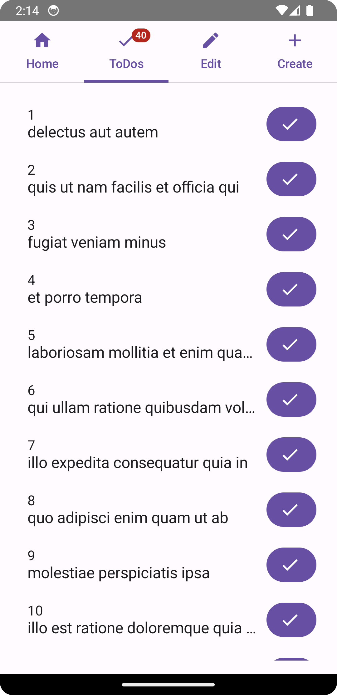
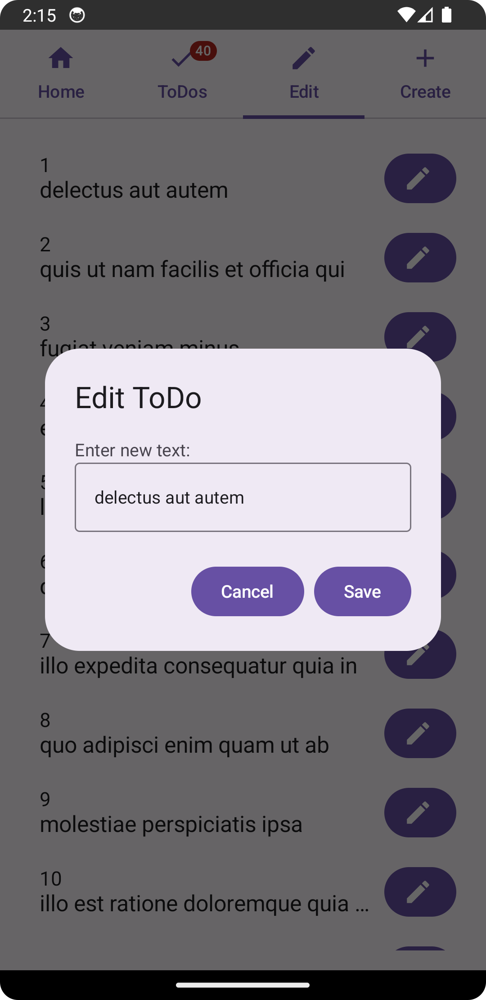
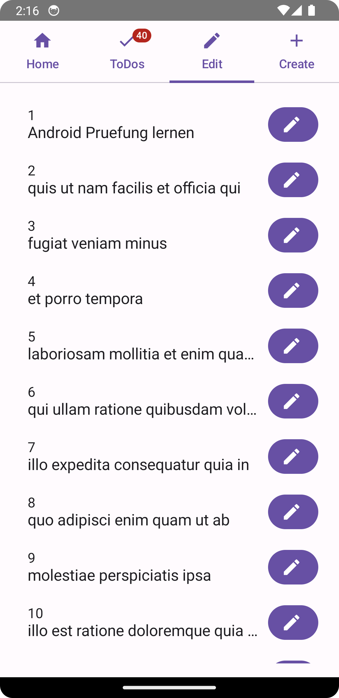
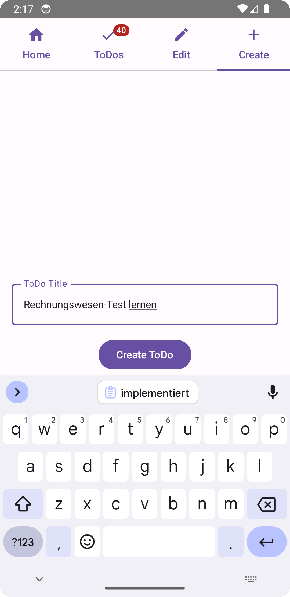
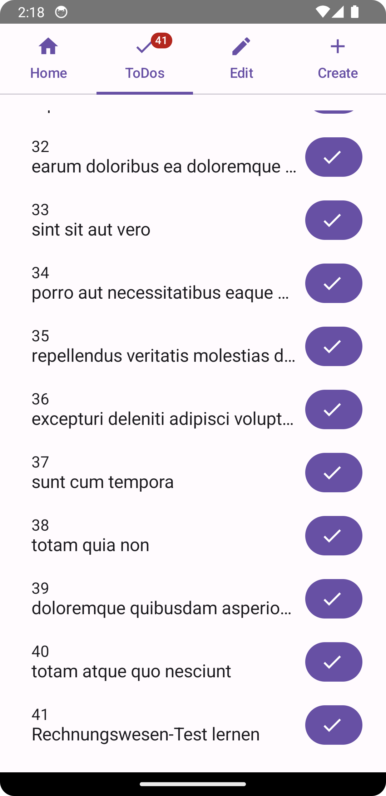

= Protokoll Android Übung 07 - ToDo

== Basis des Projektes
* Prof. Abergers ToDo-Projekt [https://github.com/caberger/android]
* Bereits implementiert waren:
** HomeView mit loadTodo-Button, welcher alle ToDos von der JsonPlaceholder-API holt
** View für alle ToDos (ID + Title)

== Meine Arbeit: Auf CRUD erweitern

=== Erledigte ToDos abhaken
* in vorhandener ToDoView DONE-Button hinzugefügt

=== Bearbeiten der vorhandenen ToDos
* neue View (EditView) implementiert

=== Hinzufügen eines neuen ToDos
* neue View (CreateView) implementiert

* neuem ToDo wird korrekte ID vergeben

== Aufbau des Projektes

[source,bash]
----
...
│   └── src
│       └── main
│           ├── java
│           │   └── at
│           │       └── htl
│           │           └── leonding
│           │               ├── feature
│           │               │   ├── create
│           │               │   ├── edit
│           │               │   ├── home
│           │               │   ├── tabscreen
│           │               │   └── todo
│           │               ├── model
│           │               ├── ui
│           │               │   └── theme
│           │               └── util
│           │                   ├── config
│           │                   ├── immer
│           │                   ├── mapper
│           │                   ├── resteasy
│           │                   └── store
...
----

== Code-Beispiele

=== ToDoService.java

[source, java]
----
// all imports
include::todo/app/src/main/java/at/htl/leonding/feature/todo/ToDoService.java[lines=25..85]
----

=== CreateView.kt

[source, kotlin]
----
// all imports
include::todo/app/src/main/java/at/htl/leonding/feature/create/CreateView.kt[lines=24..53]
----

=== EditView.kt

[source, kotlin]
----
// all imports
include::todo/app/src/main/java/at/htl/leonding/feature/edit/EditView.kt[lines=23...116]
// previews
----

=== TabView.kt

[source, kotlin]
----
// all imports
include::todo/app/src/main/java/at/htl/leonding/feature/tabscreen/TabView.kt[lines=38..95]
// previews
----